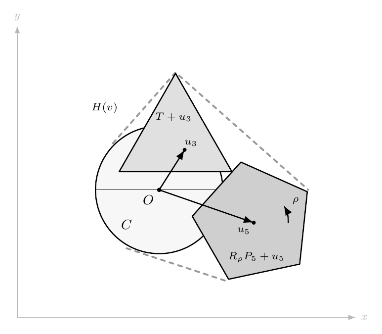
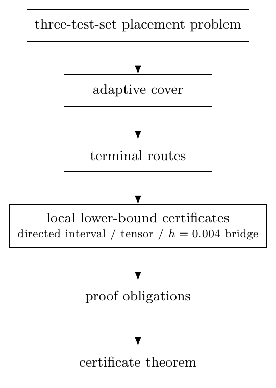

# A Reproducible Certificate for the Brass-Sharifi 0.832 Lower Bound

This repository is an artifact and verification package for the Brass-Sharifi 0.832 lower bound in the **convex** version of Lebesgue's universal cover problem. The numerical lower bound is unchanged:

```math
\alpha_{\mathrm{cvx}} \geq 0.832.
```

The purpose of the repository is not to introduce a new lower bound. Its purpose is to organize the computational part of the Brass-Sharifi argument as a finite, inspectable certificate: source archives, an adaptive ledger, terminal-route replay data, local lower-bound certificates, compact integrity audits, and a proof-obligation/signoff layer. The accompanying manuscript is included under `paper/`.

---

## 1. Overview

The repository provides two complementary views of the BS0832 reproduction.

First, it gives a mathematical certificate outline: a normalized three-test-set placement problem, a recorded Branch-B domain relation, local lower-bound certificates on terminal routes, and a finite-cover implication that leads to the convex universal-cover lower bound.

Second, it gives a reproducibility workflow: reference certificate artifacts, a certificate-artifact SHA256 gate, staged replay scripts, and a final verifier. The fast verifier checks the bundled signed-candidate certificate package; the staged replay scripts regenerate the V106-V109 chain for inspection and comparison.

---

## 2. Background: the convex Lebesgue universal cover problem

Lebesgue's universal cover problem asks for a planar set that contains a congruent copy of every planar set of diameter one. In the convex version considered here, the covering set is required to be convex. Let

```math
\mathcal{U}_{\mathrm{cvx}}
=
\left\{
K \subset \mathbb{R}^{2}:
K \text{ is convex and contains a congruent copy of every diameter-one planar set}
\right\}.
```

The convex quantity is

```math
\alpha_{\mathrm{cvx}}
=
\inf_{K\in\mathcal{U}_{\mathrm{cvx}}}\mathrm{area}(K).
```

The Brass-Sharifi result gives the lower bound 0.832 for this convex quantity. This repository concerns only that convex lower-bound computation.

---

## 3. The Brass-Sharifi three-test-set placement problem

### 3.1 The three diameter-one test sets

The computation uses three diameter-one test sets:

```math
C = \text{the disk of diameter }1,
\qquad
T = \text{the equilateral triangle of diameter }1,
\qquad
P_{5} = \text{the regular pentagon of diameter }1.
```

If a convex universal cover contains congruent copies of these three sets, then by convexity it also contains their convex hull. A uniform lower bound for the area of that hull is therefore a lower bound for the area of any convex universal cover.

### 3.2 Normalized placement parameters

Following the Brass-Sharifi normalization used by the certificate model, the disk is fixed at the origin and the triangle orientation is fixed. A normalized placement is recorded by

```math
v=(\rho,x_{3},y_{3},x_{5},y_{5}),
```

with

```math
u_{3}=(x_{3},y_{3}),
\qquad
u_{5}=(x_{5},y_{5}).
```

Here $`u_{3}`$ translates the triangle, $`\rho`$ rotates the pentagon, and $`u_{5}`$ translates the pentagon.

### 3.3 The convex-hull area functional

Let $`R_{\rho}`$ denote rotation by angle $`\rho`$. Define

```math
H(v)=\mathrm{conv}\left(C\cup(T+u_{3})\cup(R_{\rho} P_{5}+u_{5})\right),
```

and

```math
A(v)=\mathrm{area}(H(v)).
```

The placement-level statement represented by the certificate is

```math
A(v)\geq 0.832
```

for every admissible normalized placement $`v`$ in the recorded reduced domain of the certificate model.

<p align="center">
  
</p>

### 3.4 From placement lower bounds to convex-cover lower bounds

Once the placement-level inequality is known for all admissible normalized placements, the convex-cover consequence follows from convexity. If $`K`$ is a convex universal cover, then $`K`$ contains congruent copies of $`C`$, $`T`$, and $`P_{5}`$. Hence $`K`$ contains the convex hull of those copies, and the normalized hull area is one of the values controlled by $`A(v)`$.

---

## 4. Scope of this repository

### 4.1 What is reproduced

The repository reproduces the Brass-Sharifi 0.832 lower-bound computation as a finite certificate package. It checks the bundled certificate records and records how those checks enter the final convex lower-bound statement.

### 4.2 What is not claimed

This repository does not claim:

- a numerical lower bound stronger than 0.832;
- a lower bound for the unrestricted nonconvex universal-cover problem;
- a proof-assistant formalization in Lean, Coq, Isabelle, or another system;
- independent external verification;
- closure of the Branch-A symbolic route described below.

### 4.3 Why `theorem_ready=false` is expected?

The final public verification summary deliberately keeps

```text
theorem_ready = false
```

This is not a failure. It means that the repository is an author-reviewed reproducible certificate package and signed-candidate artifact, not a completed proof-assistant theorem development.

---

## 5. What this repository adds

### 5.1 Proof-organization contribution

The lower bound itself is due to Brass and Sharifi. The additional proof-organization contribution here is to separate the computation into explicit layers:

1. a placement-level inequality for $`A(v)`$;
2. a recorded domain-cover relation for normalized placements;
3. local lower-bound certificates on terminal route domains;
4. a finite-cover implication that aggregates local certificates;
5. a convex universal-cover consequence for $`\alpha_{\mathrm{cvx}}`$;
6. an explicit proof-obligation record, grouped as OB-A through OB-F.

### 5.2 Verification and artifact contribution

At the artifact level, the repository supplies:

1. a finite adaptive parent-child ledger;
2. a terminal-route replay table;
3. three local certificate families with a common post-guard acceptance interface;
4. compact block-hash audits for large tables;
5. a proof-obligation ledger;
6. a proof-boundary audit that prevents stronger or out-of-scope claims;
7. a final signoff schema and author self-review record;
8. reference-signed and generated-chain verification modes.

### 5.3 Relation to the original Brass-Sharifi computation

The repository does not replace the original theorem. It packages the computational part of the argument into a form that can be rerun, audited, and compared against a stable certificate inventory. The numerical statement remains exactly the Brass-Sharifi 0.832 convex lower bound.

---

## 6. Finite certificate model

A finite certificate does not mean that the original geometric problem is finite. It means that the certificate used for verification is a finite, machine-readable object. In this repository, the finite object consists of:

1. a finite parent-child subdivision ledger;
2. finitely many terminal routes;
3. finitely many directed interval, tensor, and bridge certificate records;
4. finite row-count and block-hash integrity records;
5. a finite proof-obligation ledger;
6. a final signed-candidate signoff record.

The verifier does not rerun an open-ended search over the continuous placement space. It checks the recorded finite objects, verifies route assignment and local acceptance records, and then applies the finite-cover aggregation principle.

---

## 7. Branch A and Branch B

### 7.1 Branch A: not claimed closed here

Branch A and Branch B are labels used inside this reproduction project. They should not be presented as terminology introduced by Brass and Sharifi.

Branch A denotes a symbolic domain-reduction route. This repository does not claim that Branch A has been closed.

### 7.2 Branch B: the adopted enlarged-domain replay route

Branch B denotes the enlarged-domain replay route used by the public certificate. The replay checks a recorded enlarged domain $`\Omega_{B}`$ that contains the admissible normalized domain represented in the certificate model.

### 7.3 The domain relation

The certificate-level domain relation is

```math
\Omega_{\mathrm{adm}} \subseteq \Omega_{B}
\subseteq \bigcup_{r\in\mathcal{R}}\Omega_{r}.
```

Here $`\Omega_{\mathrm{adm}}`$ is the recorded reduced admissible normalized placement domain, $`\Omega_{B}`$ is the enlarged Branch-B replay domain, and $`\Omega_{r}`$ is the terminal-route domain for route $`r`$.

### 7.4 Why Branch B is conservative?

The Branch-B route is conservative in the required direction: proving the lower bound on the larger recorded domain $`\Omega_{B}`$ is stronger than proving it only on $`\Omega_{\mathrm{adm}}`$. All public certificate claims in this repository use Branch B, not Branch A.

---

## 8. Local certificate families

### 8.1 The common post-guard interface

For each terminal route $`r`$, the local verifier records a post-guard lower bound $`L^{\mathrm{post}}_{r}`$ satisfying

```math
L^{\mathrm{post}}_{r} \leq \inf_{w\in\Omega_{r}} A(w),
\qquad
L^{\mathrm{post}}_{r} - 0.832 \geq 10^{-7}.
```

Therefore, for every $`v\in\Omega_{r}`$,

```math
A(v)
\geq \inf_{w\in\Omega_{r}}A(w)
\geq L^{\mathrm{post}}_{r}
\geq 0.832 + 10^{-7}
> 0.832.
```

The three local certificate families differ in how they produce their post-guard records. They enter the final aggregation through this same route-level interface.

### 8.2 Directed interval certificates

The directed interval family is the main local certificate family. It discharges 338,367 terminal routes using 41,261 directed rows. The smallest recorded post-guard margin above 0.832 is approximately

```math
4.307276422\times 10^{-6}.
```

### 8.3 Local tensor certificates

The local tensor family handles 18,380 terminal routes through tensor member and package records. It uses 8,751 tensor members organized into 125 packages. The smallest recorded post-guard margin above 0.832 is approximately

```math
2.318262102\times 10^{-5}.
```

### 8.4 The $`h=0.004`$ bridge

The $`h=0.004`$ bridge covers a residual set of 69 terminal routes through 282 frozen bridge witness rows. In the final aggregation it is treated as a separate bridge component rather than being absorbed into the directed or tensor families.

### 8.5 How the three families enter the aggregation

Every terminal route is assigned to exactly one of the three families. Once the local record for route $`r`$ is accepted, the final aggregation uses only the route-level statement

```math
A(v)\geq 0.832,
\qquad v\in\Omega_{r}.
```

---

## 9. Certificate theorem and convex universal-cover consequence

### 9.1 Finite-cover implication

Assume the domain relation

```math
\Omega_{\mathrm{adm}} \subseteq \Omega_{B}
\subseteq \bigcup_{r\in\mathcal{R}}\Omega_{r}
```

and assume that every terminal route satisfies

```math
A(v)\geq 0.832,
\qquad v\in\Omega_{r}.
```

Then every admissible normalized placement satisfies

```math
A(v)\geq 0.832,
\qquad v\in\Omega_{\mathrm{adm}}.
```

Indeed, if $`v\in\Omega_{\mathrm{adm}}`$, then $`v\in\Omega_{B}`$, and hence $`v`$ lies in at least one terminal-route domain $`\Omega_{r}`$. The local certificate for that route gives the inequality.

### 9.2 BS0832 certificate theorem

The BS0832 certificate theorem says that, under the stated verifier and proof-obligation model, acceptance of the finite certificate supplies the two inputs of the finite-cover implication:

1. the Branch-B domain relation;
2. a local route-level lower bound on every terminal route.

The certificate theorem therefore yields the placement-level inequality

```math
A(v)\geq 0.832
```

for all admissible normalized placements recorded by the certificate domain model.

### 9.3 Convex universal-cover consequence

If $`K`$ is a convex universal cover, then $`K`$ contains congruent copies of $`C`$, $`T`$, and $`P_{5}`$. Since $`K`$ is convex, it contains their convex hull. After normalization, that hull has area $`A(v)`$ for an admissible placement $`v`$. Hence

```math
\mathrm{area}(K)\geq A(v)\geq 0.832.
```

Taking the infimum over all convex universal covers gives

```math
\alpha_{\mathrm{cvx}}\geq 0.832.
```

### 9.4 Logical dependency structure

<p align="center">
  
</p>

The figure summarizes the dependency chain: Branch-B domain relation plus local route certificates imply the finite-cover statement; the certificate theorem supplies those inputs under the verifier model; the convex-cover conclusion follows by convexity.

---

## 10. Certificate data and main counts

### 10.1 Adaptive ledger and terminal routes

| Component | Rows/items | Role |
|---|---:|---|
| Adaptive parent-child ledger | 379,192 | finite subdivision tree |
| Adaptive terminal routes | 356,816 | terminal route closure |

### 10.2 Route-family counts

| Route family | Terminal routes |
|---|---:|
| Directed interval certificates | 338,367 |
| Local tensor certificates | 18,380 |
| $`h=0.004`$ bridge | 69 |
| **Total** | **356,816** |

### 10.3 Supporting certificate tables

| Supporting table | Rows/items |
|---|---:|
| Directed interval rows | 41,261 |
| Local tensor members | 8,751 |
| Local tensor packages | 125 |
| $`h=0.004`$ bridge witnesses | 282 |

### 10.4 Post-guard margins and acceptance threshold

| Family | Minimum post-guard margin above 0.832 |
|---|---:|
| Directed interval | approximately $`4.307276422\times 10^{-6}`$ |
| Local tensor | approximately $`2.318262102\times 10^{-5}`$ |
| Verifier acceptance threshold | $`10^{-7}`$ |

The bridge records pass their zero-violation check for the residual route set assigned to that component.

---

## 11. V106-V109 stage labels

The labels V106-V109 are public stage labels inherited from the development history of this certificate package. They are not mathematical constants and not theorem numbers.

| Stage | Role |
|---|---|
| V106 | Branch-B domain replay and final kernel-closure checks |
| V107 | independent replay, release-candidate checks, and compact block-hash audits |
| V108 | theorem-level reproduction closure attempt and proof-obligation binding |
| V109 | final signoff adjudication and theorem-ready gate |

---

## 12. Repository layout

```text
universal-cover-bs0832-reproduction/
├── README.md
├── README.zh-CN.md
├── ARTIFACTS.md
├── CERTIFICATE.md
├── EXPECTED_OUTPUTS.md
├── CITATION.cff
├── assets/figures/
├── app/domain/
├── scripts/
├── inputs/
├── certificate/
│   └── intermediate/
└── paper/
```

| Path | Role |
|---|---|
| `inputs/` | Source archives needed for staged reproduction. |
| `certificate/` | Final signed-candidate certificate, author signoff, manifest, and checksum list. |
| `certificate/intermediate/` | Reference V106-V108 feedback archives used by the reference-signed path. |
| `app/domain/` | Python implementation of certificate checks and staged replay logic. |
| `scripts/` | Command-line entry points; run them as `python -m scripts.<name>`. |
| `paper/` | Compiled accompanying manuscript PDF. |
| `assets/figures/` | Figures used by the README files. |
| `runs/` | Local output directory created by scripts; it is ignored by Git. |

There is no `.github/workflows/` directory. The certificate package is meant to be verifiable locally without relying on GitHub Actions.

---

## 13. Manifest and SHA256 policy

### 13.1 Why only certificate artifacts are SHA-gated?

The public checksum gate is a **certificate-artifact manifest**, not a whole-repository manifest. This allows README files, manuscript files, figures, and source-code comments to be improved without changing the certificate data itself.

### 13.2 Files included in the certificate SHA gate

The SHA256 gate covers only certificate artifacts:

```text
inputs/*.zip
certificate/intermediate/*.zip
certificate/feedback_v109_signed_author_self_review.zip
certificate/reviewer_signoff_v109.json
```

### 13.3 Files excluded from the certificate SHA gate

The following files are intentionally outside the certificate-artifact SHA gate:

```text
README.md
README.zh-CN.md
ARTIFACTS.md
CERTIFICATE.md
EXPECTED_OUTPUTS.md
paper/**
assets/**
app/**
scripts/**
requirements.txt
environment.yml
pyproject.toml
CITATION.cff
```

### 13.4 Why README, paper, and source-code comments do not affect certificate verification?

The final verifier still requires all certificate input archives, reference intermediate archives, the final v109 certificate archive, the signoff JSON, `MANIFEST.json`, and `SHA256SUMS.txt`. It checks the artifact hashes and verifies that `MANIFEST.json` and `SHA256SUMS.txt` describe the same artifact set. Documentation edits do not change the mathematical certificate artifacts and therefore do not change the certificate SHA gate.

---

## 14. Installation

### 14.1 Using `pip`

Command:

```bash
python -m pip install -r requirements.txt
```

Purpose: install the Python dependency set needed by the verifier and staged replay scripts.

Expected result: the command exits successfully, and the modules under `app/` and `scripts/` can be imported by Python.

### 14.2 Using `conda`

Commands:

```bash
conda env create -f environment.yml
conda activate bs0832-reproduction
```

Purpose: create and activate an isolated environment for the repository.

Expected result: the environment is created successfully, and subsequent `python -m scripts...` commands run inside that environment.

---

## 15. Fast final verification

### 15.1 Command

```bash
python -m scripts.run_final_verification --root . --log-level INFO
```

### 15.2 Purpose

This command checks the bundled reference certificate artifacts, the certificate-only manifest/SHA256 gate, the final signed-candidate archive, and the structured author self-review signoff.

### 15.3 Output files

```text
runs/final_verification/final_verification_summary.json
runs/final_verification/final_verification.log
```

### 15.4 Expected key fields

A successful run reports:

```text
status = success
bs0832_final_repository_verification_passed = true
required_file_count = 14
sha256_checked_file_count = 12
theorem_ready_signed_candidate = true
theorem_ready = false
proof_boundary_violations = 0
```

The value `theorem_ready=false` is expected and is part of the proof-boundary discipline of the repository.

---

## 16. Full staged replay

### 16.1 Command

```bash
python -m scripts.run_all_stages --root . --log-level INFO
```

### 16.2 Purpose

This command runs the public staged chain: V106, V107, V108, V109 reference-signed, and V109 generated-chain.

### 16.3 Output files

```text
runs/stage_all/stage_chain_summary.json
runs/stage_all/public_stage_chain.log
runs/stage_v106/
runs/stage_v107/
runs/stage_v108/
runs/stage_v109_reference/
runs/stage_v109_generated/
```

### 16.4 Expected key fields

A successful staged chain reports:

```text
status = success
```

and each stage entry in `stage_chain_summary.json` reports success.

### 16.5 Why V107 is usually the heaviest stage?

V107 performs the largest independent replay and compact block-hash audit checks. It is therefore usually the slowest stage in the public chain.

---

## 17. Single-stage commands

### 17.1 V106

Command:

```bash
python -m scripts.run_stage_v106 --root . --log-level INFO
```

Purpose: replay Branch-B domain records, adaptive ledger closure, and kernel-closure checks.

Expected output: `runs/stage_v106/` containing a V106 feedback ZIP, summary JSON, and log file.

### 17.2 V107

Command:

```bash
python -m scripts.run_stage_v107 --root . --log-level INFO
```

Purpose: run independent replay checks and compact integrity audits for large tables.

Expected output: `runs/stage_v107/` containing a V107 feedback ZIP, summary JSON, and log file.

### 17.3 V108

Command:

```bash
python -m scripts.run_stage_v108 --root . --log-level INFO
```

Purpose: check theorem-level reproduction closure, proof-obligation binding, and scope records.

Expected output: `runs/stage_v108/` containing a V108 feedback ZIP, summary JSON, and log file.

### 17.4 V109 reference-signed

Command:

```bash
python -m scripts.run_stage_v109 --root . --mode reference-signed --log-level INFO
```

Purpose: validate the bundled reference V108 archive against the author self-review signoff and produce the signed-candidate V109 decision.

Expected output: `runs/stage_v109_reference/` containing a V109 summary and log.

### 17.5 V109 generated-chain

Command:

```bash
python -m scripts.run_stage_v109 --root . --mode generated-chain \
  --v108-feedback-zip runs/stage_v108/feedback_v108_bs0832_theorem_level_reproduction_closure_attempt_and_final_signoff_package.zip \
  --log-level INFO
```

Purpose: apply the V109 logic to a freshly generated V108-style archive.

Expected output: `runs/stage_v109_generated/` containing a generated-chain V109 summary and log.

---

## 18. `reference-signed` versus `generated-chain`

The `reference-signed` path uses the reference V108 archive reviewed in `certificate/reviewer_signoff_v109.json`. This is the signed-candidate path used by the fast verifier.

The `generated-chain` path uses a freshly generated V108-style archive from the local staged replay. Such an archive can be semantically equivalent to the reference archive while still having a different byte-level hash. It does not automatically inherit the author signoff attached to the reference V108 archive.

---

## 19. Why regenerated ZIP files need not be byte-identical?

A regenerated ZIP archive may differ byte-for-byte from the bundled reference ZIP because ZIP metadata can vary: timestamps, compression settings, file ordering, platform metadata, or run identifiers. The staged summaries record generated and reference hashes for traceability, but byte-for-byte equality is not the only meaningful reproducibility criterion.

The certificate-artifact SHA gate is reserved for the bundled reference artifacts. Fresh local outputs belong under `runs/` and should not be committed as replacements unless a new signed release is intentionally prepared.

---

## 20. Troubleshooting and common questions

### 20.1 SHA256 failures

If a SHA256 check fails, first confirm that the certificate artifact files under `inputs/` and `certificate/` have not been edited, recompressed, or partially downloaded. Documentation changes should not affect the artifact SHA gate.

### 20.2 Generated ZIP files differ from reference ZIP files

This is not automatically a failure. Compare the staged summary fields and logs. A generated archive may differ bytewise for metadata reasons while still passing the staged replay logic.

### 20.3 `theorem_ready=false`

This is expected. The repository is a reproducible signed-candidate certificate package. It does not claim proof-assistant formalization or independent external verification.

### 20.4 No stronger numerical lower-bound claim

The repository concerns only the Brass-Sharifi 0.832 convex lower bound. It does not claim a stronger numerical lower bound.

### 20.5 No unrestricted nonconvex claim

The repository concerns the convex quantity $`\alpha_{\mathrm{cvx}}`$. It does not assert a lower bound for the unrestricted nonconvex universal-cover problem.

### 20.6 No proof-assistant formalization claim

The repository contains Python verifiers and certificate records. It does not contain a Lean, Coq, Isabelle, or comparable proof-assistant formalization.

---

## 21. Citation

Please cite the Brass-Sharifi paper as the source of the original mathematical lower bound, and cite this repository as the reproducible certificate package for the BS0832 reproduction.

---

## 22. License and acknowledgements

The repository is released under the license recorded in `LICENSE`. The accompanying manuscript acknowledges the use of ChatGPT as an auxiliary tool for organization, reproducibility workflow checks, and exposition; the mathematical claims, computations, certificate judgments, and final text are the author's responsibility.
